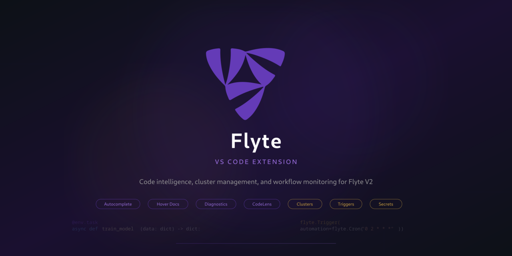
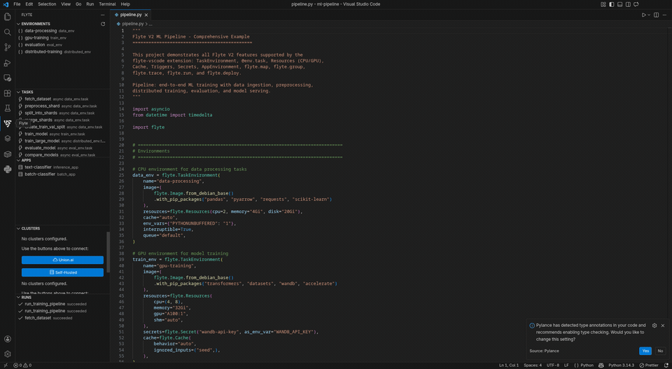
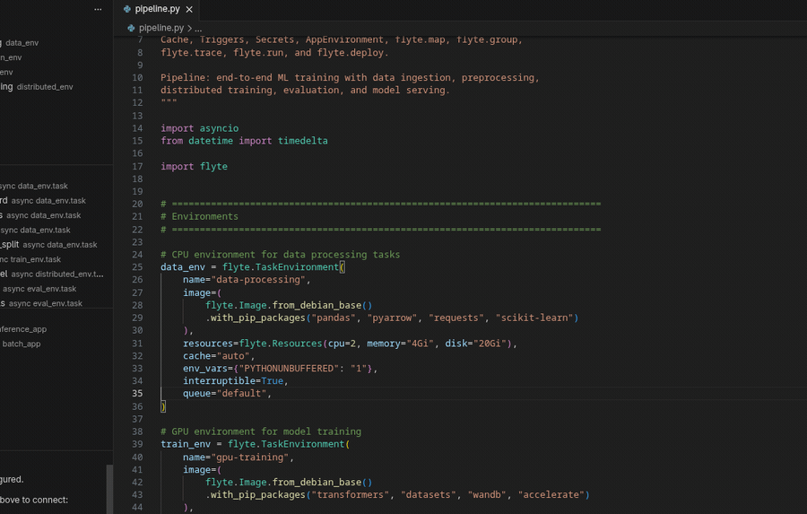
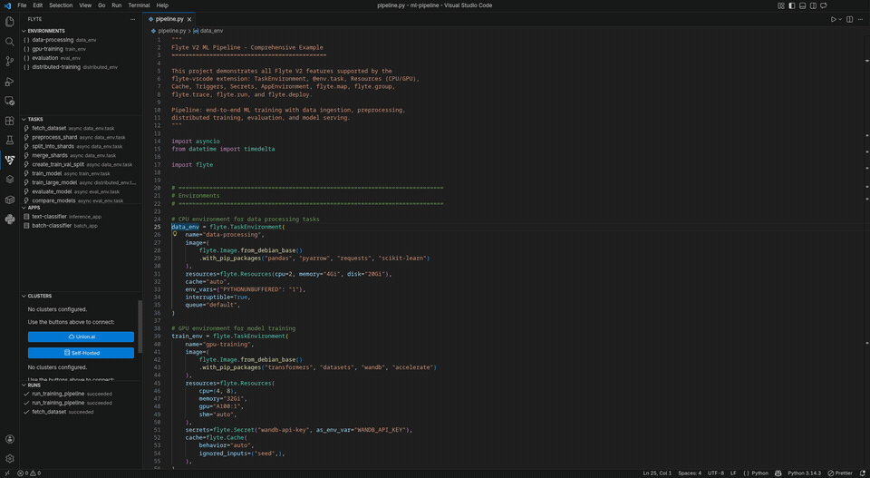
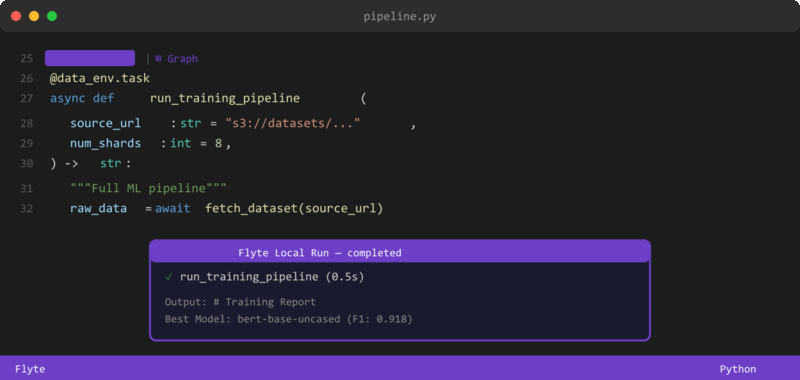
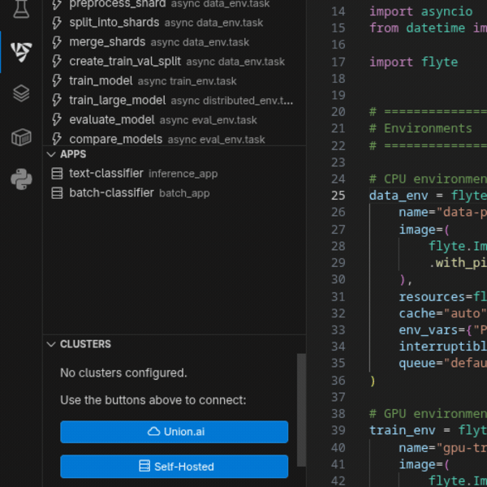

<p align="center">
  
</p>

<p align="center">
  <strong>Complete Flyte V2 development toolkit: code intelligence, cluster management, secrets, triggers, and workflow monitoring.</strong>
</p>

<p align="center">
  <a href="https://marketplace.visualstudio.com/items?itemName=atoolz.flyte-vscode">
    
  </a>
  <a href="https://marketplace.visualstudio.com/items?itemName=atoolz.flyte-vscode">
    
  </a>
  <a href="https://github.com/andreahlert/flyte-vscode/blob/main/LICENSE">
    
  </a>
  
</p>

<br>

## Features

### Sidebar

> All Flyte resources at a glance: environments, tasks, apps, clusters, runs, secrets, and triggers.

<p align="center">
  
</p>

### Autocomplete

> Smart completions inside `TaskEnvironment()`, `Resources()`, `AppEnvironment()`, `Trigger()`, `Cache()`, `Secret()`, and `@env.task()` with types, defaults, and docs.

<p align="center">
  
</p>

### Hover Documentation

> Hover over any Flyte class or parameter to see inline docs. Covers `flyte.run`, `flyte.deploy`, `flyte.map`, `flyte.group`, `flyte.trace`, and all SDK classes.

<p align="center">
  
</p>

### CodeLens

> `Run Task`, `Deploy`, and `Graph` actions above every `@env.task` function. Run locally with TUI or deploy to any cluster.

<p align="center">
  
</p>

### Cluster Management

> Connect to Union.ai or self-hosted clusters. Create local clusters with one click (k3d + Flyte Manager).

<p align="center">
  
</p>

### Runs, Secrets & Triggers

| Feature | Description |
|---------|-------------|
| **Runs** | Local + remote runs with status icons. Union (gold) or Flyte (purple) logo with colored dots: green=succeeded, red=failed, orange=running. Filter by All/Local/Remote. |
| **Secrets** | Create, list, and delete secrets on any cluster. Password-masked input. |
| **Triggers** | List triggers with status. Activate, deactivate, or delete from sidebar. |
| **Deploy** | Deploy environments to cluster. Asks which environment when multiple exist. |
| **Diagnostics** | Real-time validation: invalid names, reserved ports, config conflicts, empty triggers. |
| **Graph** | ASCII DAG in terminal with colors, parameter signatures, and badges. |

### Snippets

15 ready-to-use patterns:

| Prefix | Description |
|--------|-------------|
| `fenv` | `TaskEnvironment` with resources |
| `ftask` | `@env.task` async function |
| `fapp` | `AppEnvironment` with port |
| `fres` | `Resources(cpu, memory, gpu)` |
| `frun` | `flyte.run()` entry point |
| `fdeploy` | `flyte.deploy()` entry point |
| `fcache` | `Cache` with behavior and ignored_inputs |
| `ftrigger` | `Trigger` with Cron or FixedRate |
| `ftrigger-daily` | `Trigger.daily()` shortcut |
| `ftrigger-hourly` | `Trigger.hourly()` shortcut |
| `fimage` | `Image.from_debian_base().with_pip_packages()` |
| `fmap` | `flyte.map()` over inputs |
| `fgroup` | `flyte.group()` context manager |
| `ftrace` | `@flyte.trace` decorator |
| `fsecret` | `Secret` with env var |

<br>

## Installation

**VS Code Marketplace:**

1. Open VS Code
2. Press `Ctrl+Shift+X` (or `Cmd+Shift+X` on macOS)
3. Search for **"Flyte"** by atoolz
4. Click **Install**

**Command Line:**

```bash
code --install-extension atoolz.flyte-vscode
```

<br>

## Quick Start

1. `pip install flyte`
2. Open a Python project with Flyte V2 code
3. Type `fenv` + Tab to create a TaskEnvironment
4. Type `ftask` + Tab to create a task
5. Click **Run Task** above the task to execute locally with TUI
6. Add a cluster via the sidebar to deploy and run remotely

<br>

## Configuration

| Setting | Default | Description |
|---------|---------|-------------|
| `flyte.cliPath` | `""` | Path to Flyte CLI. Empty for auto-discovery |
| `flyte.pythonPath` | `""` | Path to Python interpreter |
| `flyte.autoRefreshRuns` | `true` | Auto-refresh runs view |
| `flyte.refreshInterval` | `10000` | Refresh interval in ms |

<br>

## Sidebar Sections

| Section | Source | Description |
|---------|--------|-------------|
| Environments | Local code | `TaskEnvironment` definitions |
| Tasks | Local code | `@env.task` functions with signatures |
| Apps | Local code | `AppEnvironment` definitions |
| Clusters | Extension config | Union.ai and self-hosted connections |
| Runs | Local + Cluster | Execution history with status icons |
| Secrets | Cluster | Secret management (create/delete) |
| Triggers | Cluster | Scheduled triggers (activate/deactivate/delete) |

<br>

## Links

- [Flyte V2 Docs](https://www.union.ai/docs/v2/flyte/user-guide/running-locally/)
- [Flyte SDK](https://github.com/flyteorg/flyte-sdk)
- [SDK Reference](https://www.union.ai/docs/v2/byoc/api-reference/flyte-sdk/)
- [CLI Reference](https://www.union.ai/docs/v2/byoc/api-reference/flyte-cli/)

<br>

## License

[MIT](LICENSE)

---

<p align="center">
  <sub>Built for the Flyte community</sub>
</p>
